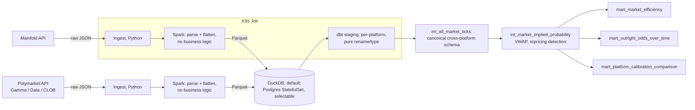

# World Cup 2026 Prediction-Market Pipeline

A Spark + dbt pipeline over Manifold Markets' public API, reconstructing implied-probability history for 2026 World Cup markets and testing whether known prediction-market biases (calibration drift, the favorite-longshot bias) hold in a narrower, faster-moving, more correlated domain than the politics/macro markets most existing research covers. Deployed as a Kubernetes batch job.

Extended with a second data source, Polymarket, a real-money exchange, to answer a different question: does calibration actually differ between a real-money market and Manifold's own Mana, given Mana can be bought with cash but never converted back? See [docs/results.md](docs/results.md)'s addendum for the answer, and [ADR-0010](docs/decisions/0010-polymarket-eligible-as-a-future-data-source.md) through [ADR-0013](docs/decisions/0013-platform-calibration-comparison-as-a-deliberate-ds-exception.md) for how it was built.

Built to gain real, hands-on experience with Spark, dbt, Kubernetes, and Postgres-as-a-StatefulSet. Tools I hadn't used in production before this project. See [Architecture Decision Records](docs/decisions/) for the reasoning behind every non-obvious choice, including the ones that add complexity this specific workload didn't strictly need.

**A note on how this was built:** my background is in data engineering. I used Claude Code throughout this project, for pairing on the code and for help with the analysis and understanding it. That means there could be errors I didn't catch. Verify anything here you're relying on, don't take it on faith.

**Status (2026-08-04):** core scope complete. Ingestion (621 Manifold markets, 4,545 answers, 1.18M bet records; 6,358 Polymarket markets, 4.4M trades, 3.2M price points), Spark, dbt's full staging/intermediate/marts layers across both platforms, a real Kubernetes Job deployment (verified end to end on minikube), a selectable Postgres target (StatefulSet), and the results writeup are all built and verified. See [docs/results.md](docs/results.md) for the actual findings, including the cross-platform comparison. See `PROJECT_SPEC.md`'s "Scope: core vs. stretch" section for the full picture; everything there is done.

## Problem statement

Manifold's own platform-wide calibration is well-documented. But there's no public breakdown by category, and none for a single-elimination sports tournament specifically. Two concrete questions:

1. **Calibration comparison.** Does calibration at the World Cup 2026 level match Manifold's platform-wide numbers, or does this narrower, more correlated, faster-moving domain behave differently?
2. **Favorite-longshot bias.** The most consistently replicated finding in prediction-market research generally: markets overprice unlikely outcomes, underprice likely ones. Does it show up here? And does market liquidity actually predict better calibration, or does that relationship hold up as poorly as some existing research suggests?

Full discussion in [docs/architecture.md](docs/architecture.md). **Answers, with a chart: [docs/results.md](docs/results.md).**

## Architecture



## What I'd do differently in production

This project intentionally uses more infrastructure than the workload strictly needs, to practice it. Short version: no Airflow (ingest/Spark/dbt run as one Kubernetes Job instead of a DAG), this is a one-time batch backfill rather than a live Kafka+Streaming pipeline, and the whole thing runs at a scale (~1.2M raw rows, one laptop) where none of Spark or Kubernetes' real value (distributed compute, multi-node scheduling, cluster-wide resource sharing) actually applies. Full dimension-by-dimension breakdown, including exactly which forcing functions would have to be true for each tool to earn its place for real: [docs/project_scale_vs_production.md](docs/project_scale_vs_production.md).

## How to run it

Locally, directly on your machine:

```bash
python -m venv venv && source venv/bin/activate
pip install -r requirements.txt
cp .env.example .env   # see requirements.md for JAVA_HOME setup

python ingest/pull_markets.py
python ingest/pull_market_answers.py
python ingest/pull_bets.py          # takes 10-15 minutes (~1.2M bet records)

python spark/flatten_to_parquet.py  # raw JSON -> typed Parquet

cd dbt
dbt deps                            # installs dbt_utils (see dbt/packages.yml)
dbt build --profiles-dir .          # builds + tests staging, intermediate, and marts

cd .. && python analysis/plot_calibration.py           # regenerates docs/images/calibration_chart.png
python analysis/compute_calibration_metrics.py         # Brier score + liquidity-tier numbers behind docs/results.md
```

Polymarket is a separate, optional addition, not part of the core pipeline above: `dbt build` never requires it, gated behind `INCLUDE_POLYMARKET` (default off, see `int_all_market_ticks.sql`). Run it to reproduce the cross-platform comparison in `docs/results.md`'s addendum:

```bash
python ingest/pull_polymarket_markets.py
python ingest/pull_polymarket_trades.py   # ~20-30 min at full scale (6,358 markets)
python ingest/pull_polymarket_prices.py   # ~30-60 min at full scale, chunked per market (ADR-0011)

python spark/flatten_polymarket.py

cd dbt && INCLUDE_POLYMARKET=true dbt build --profiles-dir .
cd .. && python analysis/compare_platform_calibration.py    # the significance test, ADR-0013
python analysis/compare_platform_predictions.py             # the descriptive team-by-team comparison
```

Or as a Kubernetes Job, on a local cluster (minikube, tested; kind should work identically):

```bash
docker build -t worldcup-pipeline:latest .
minikube start --driver=docker
minikube image load worldcup-pipeline:latest   # no registry involved, see k8s/job.yaml

kubectl apply -f k8s/configmap.yaml
kubectl apply -f k8s/job.yaml
kubectl logs -f -l job-name=worldcup-pipeline   # watch it run
kubectl get jobs                                # STATUS: Complete when done, ~25-30 min
```

Both run the identical pipeline (same `run_pipeline.sh` entrypoint); the Kubernetes path just runs it inside a pod instead of your shell. See [ADR-0003](docs/decisions/0003-kubernetes-job-not-cronjob-or-deployment.md) for why this is a Job, not a Deployment or CronJob.

Postgres is also available as a selectable dbt target, DuckDB stays the default everywhere else, for the Kubernetes StatefulSet/PVC pattern specifically (see [ADR-0004](docs/decisions/0004-local-warehouse-duckdb-then-postgres.md)):

```bash
kubectl create secret generic postgres-credentials \
  --from-literal=POSTGRES_USER=worldcup \
  --from-literal=POSTGRES_PASSWORD=<your own value> \
  --from-literal=POSTGRES_DB=worldcup
kubectl apply -f k8s/postgres.yaml
kubectl port-forward svc/postgres 5432:5432 &

export POSTGRES_HOST=localhost POSTGRES_USER=worldcup POSTGRES_PASSWORD=<same value> POSTGRES_DB=worldcup
python spark/load_parquet_to_postgres.py        # Postgres has no DuckDB-style direct Parquet read, needs real tables loaded first
cd dbt && dbt build --profiles-dir . --target postgres
```

To browse the data directly: `duckdb -ui manifold.duckdb` (from inside `dbt/`) opens DuckDB's built-in local web UI, a schema browser and SQL editor against the same database file dbt just built into. See [requirements.md](requirements.md) for the CLI install.

To browse the project's structure instead of the data (model lineage graph, column-level descriptions, which models depend on which): `dbt docs generate --profiles-dir . && dbt docs serve` (from inside `dbt/`) builds and serves dbt's own documentation site from the `description:` fields already written in each model's `schema.yml`.

## Data sources

- [Manifold Markets](https://manifold.markets) public API, no authentication required. See [ADR-0001](docs/decisions/0001-data-source-manifold-not-kalshi.md) for why this project doesn't use Kalshi despite starting there.
- [Polymarket](https://polymarket.com) public API (Gamma, Data, CLOB), also no authentication required for the read-only endpoints this project uses. Optional, see "How to run it" above. See [ADR-0010](docs/decisions/0010-polymarket-eligible-as-a-future-data-source.md) for the terms-of-use verification (read directly from the actual PDF, not a summary) and [ADR-0011](docs/decisions/0011-polymarket-api-shape-and-full-history-pricing.md) for the real API shape and its quirks.

See [docs/data_dictionary.md](docs/data_dictionary.md) for the schema of everything ingested from both.

## Project docs

- [docs/architecture.md](docs/architecture.md): problem statement, architecture, tool-by-tool reasoning
- [docs/results.md](docs/results.md): the actual finding, with a chart showing a real favorite-longshot bias pattern, honestly caveated
- [docs/data_dictionary.md](docs/data_dictionary.md): schema of ingested data
- [docs/decisions/](docs/decisions/): ADRs for every non-obvious call made on this project
- [docs/data_engineering_best_practices.md](docs/data_engineering_best_practices.md): checklist of standard DE practices, applied, planned, or deliberately skipped, and why
- [docs/project_scale_vs_production.md](docs/project_scale_vs_production.md): dimension by dimension, this project's actual scale vs. what would earn each tool's place at a real company
- [requirements.md](requirements.md): system prerequisites (Python, Java) and how to set them up, distinct from `requirements.txt`
