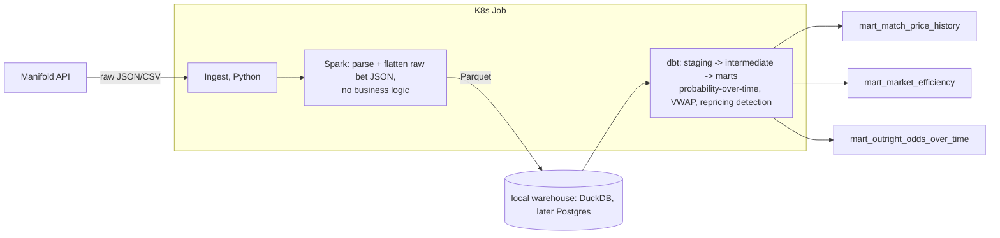

# World Cup 2026 Prediction-Market Pipeline

A Spark + dbt pipeline over Manifold Markets' public API, reconstructing implied-probability history for 2026 World Cup markets and testing whether known prediction-market biases (calibration drift, the favorite-longshot bias) hold in a narrower, faster-moving, more correlated domain than the politics/macro markets most existing research covers. Deployed as a Kubernetes batch job.

Built to gain real, hands-on experience with Spark, dbt, and Kubernetes. Three tools I hadn't used in production before this. See [Architecture Decision Records](docs/decisions/) for the reasoning behind every non-obvious choice, including the ones that add complexity this specific workload didn't strictly need.

**Status (2026-07-31):** in progress. Ingestion (621 markets, 4,545 answers, 1.18M bet records), Spark, dbt's full staging/intermediate/marts layers, and a real results writeup are all built and verified. See [docs/results.md](docs/results.md) for the actual finding. Kubernetes is designed (see docs below) but not yet implemented, the one piece left for core scope. See `PROJECT_SPEC.md`'s "Scope: core vs. stretch" section for the full picture.

## Problem statement

Manifold's own platform-wide calibration is well-documented. But there's no public breakdown by category, and none for a single-elimination sports tournament specifically. Two concrete questions:

1. **Calibration comparison.** Does calibration at the World Cup 2026 level match Manifold's platform-wide numbers, or does this narrower, more correlated, faster-moving domain behave differently?
2. **Favorite-longshot bias.** The most consistently replicated finding in prediction-market research generally: markets overprice unlikely outcomes, underprice likely ones. Does it show up here? And does market liquidity actually predict better calibration, or does that relationship hold up as poorly as some existing research suggests?

Full discussion in [docs/architecture.md](docs/architecture.md). **Answers, with a chart: [docs/results.md](docs/results.md).**

## Architecture



## What I'd do differently in production

This project intentionally uses more infrastructure than the workload strictly needs, to practice it. Short version: no Airflow (ingest/Spark/dbt run as one Kubernetes Job instead of a DAG), this is a one-time batch backfill rather than a live Kafka+Streaming pipeline, and the whole thing runs at a scale (~1.2M raw rows, one laptop) where none of Spark or Kubernetes' real value (distributed compute, multi-node scheduling, cluster-wide resource sharing) actually applies. Full dimension-by-dimension breakdown, including exactly which forcing functions would have to be true for each tool to earn its place for real: [docs/project_scale_vs_production.md](docs/project_scale_vs_production.md).

## How to run it

Everything except the Kubernetes deployment works end to end as of this writing.

```bash
python -m venv venv && source venv/bin/activate
pip install -r requirements.txt
cp .env.example .env   # see requirements.md for JAVA_HOME setup

python ingest/pull_markets.py
python ingest/pull_market_answers.py
python ingest/pull_bets.py          # takes 10-15 minutes (~1.2M bet records)

python spark/flatten_to_parquet.py  # raw JSON -> typed Parquet

cd dbt
dbt deps                            # installs dbt_utils (see dbt/packages.yml)
dbt build --profiles-dir .          # builds + tests staging, intermediate, and marts

cd .. && python analysis/plot_calibration.py           # regenerates docs/images/calibration_chart.png
python analysis/compute_calibration_metrics.py         # Brier score + liquidity-tier numbers behind docs/results.md
```

To browse the data directly: `duckdb -ui manifold.duckdb` (from inside `dbt/`) opens DuckDB's built-in local web UI, a schema browser and SQL editor against the same database file dbt just built into. See [requirements.md](requirements.md) for the CLI install.

To browse the project's structure instead of the data (model lineage graph, column-level descriptions, which models depend on which): `dbt docs generate --profiles-dir . && dbt docs serve` (from inside `dbt/`) builds and serves dbt's own documentation site from the `description:` fields already written in each model's `schema.yml`.

## Data source

[Manifold Markets](https://manifold.markets) public API, no authentication required. See [ADR-0001](docs/decisions/0001-data-source-manifold-not-kalshi.md) for why this project doesn't use Kalshi despite starting there, and [docs/data_dictionary.md](docs/data_dictionary.md) for the schema of everything ingested so far.

## Project docs

- [docs/architecture.md](docs/architecture.md): problem statement, architecture, tool-by-tool reasoning
- [docs/results.md](docs/results.md): the actual finding, with a chart showing a real favorite-longshot bias pattern, honestly caveated
- [docs/data_dictionary.md](docs/data_dictionary.md): schema of ingested data
- [docs/decisions/](docs/decisions/): ADRs for every non-obvious call made on this project
- [docs/data_engineering_best_practices.md](docs/data_engineering_best_practices.md): checklist of standard DE practices, applied, planned, or deliberately skipped, and why
- [docs/project_scale_vs_production.md](docs/project_scale_vs_production.md): dimension by dimension, this project's actual scale vs. what would earn each tool's place at a real company
- [requirements.md](requirements.md): system prerequisites (Python, Java) and how to set them up, distinct from `requirements.txt`
