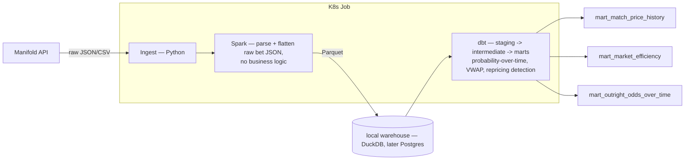

# World Cup 2026 Prediction-Market Pipeline

A Spark + dbt pipeline over Manifold Markets' public API, reconstructing implied-probability history for 2026 World Cup markets and testing whether known prediction-market biases (calibration drift, the favorite-longshot bias) hold in a narrower, faster-moving, more correlated domain than the politics/macro markets most existing research covers — deployed as a Kubernetes batch job.

Built to gain real, hands-on experience with Spark, dbt, and Kubernetes — three tools I hadn't used in production before this. See [Architecture Decision Records](docs/decisions/) for the reasoning behind every non-obvious choice, including the ones that add complexity this specific workload didn't strictly need.

**Status (2026-07-30):** in progress. Ingestion (markets, market answers, 400K+ bet records) and the Spark extract/load step are both built and verified. dbt and Kubernetes are designed (see docs below) but not yet implemented. See `PROJECT_SPEC.md`'s "Scope: core vs. stretch" section for exactly what's required to reach a demoable state.

## Problem statement

Manifold's own platform-wide calibration is well-documented — but there's no public breakdown by category, and none for a single-elimination sports tournament specifically. Two concrete questions:

1. **Calibration comparison** — does calibration at the World Cup 2026 level match Manifold's platform-wide numbers, or does this narrower, more correlated, faster-moving domain behave differently?
2. **Favorite-longshot bias** — the most robust finding in prediction-market research generally (markets overprice unlikely outcomes, underprice likely ones) — does it show up here, and does market liquidity actually predict better calibration, or does that relationship hold up as poorly as some existing research suggests?

Full discussion in [docs/architecture.md](docs/architecture.md).

## Architecture

## What I'd do differently in production

This project intentionally uses more infrastructure than the workload strictly needs, in order to practice it. Short version: no Airflow (ingest/Spark/dbt run as one Kubernetes Job instead of a DAG), this is a one-time batch backfill rather than a live Kafka+Streaming pipeline, and the whole thing runs at a scale (~400K rows, one laptop) where none of Spark or Kubernetes' real value — distributed compute, multi-node scheduling, cluster-wide resource sharing — actually applies. Full dimension-by-dimension breakdown, including exactly which forcing functions would have to be true for each tool to earn its place for real: [docs/project_scale_vs_production.md](docs/project_scale_vs_production.md).

## How to run it

_Coming as each stage is built — see [docs/architecture.md](docs/architecture.md#status) for current status._

## Data source

[Manifold Markets](https://manifold.markets) public API, no authentication required. See [ADR-0001](docs/decisions/0001-data-source-manifold-not-kalshi.md) for why this project doesn't use Kalshi despite starting there, and [docs/data_dictionary.md](docs/data_dictionary.md) for the schema of everything ingested so far.

## Project docs

- [docs/architecture.md](docs/architecture.md) — problem statement, architecture, tool-by-tool reasoning
- [docs/data_dictionary.md](docs/data_dictionary.md) — schema of ingested data
- [docs/decisions/](docs/decisions/) — ADRs for every non-obvious call made on this project
- [docs/data_engineering_best_practices.md](docs/data_engineering_best_practices.md) — checklist of standard DE practices: applied, planned, or deliberately skipped and why
- [docs/project_scale_vs_production.md](docs/project_scale_vs_production.md) — dimension-by-dimension: this project's actual scale vs. what would earn each tool's place at a real company
- [requirements.md](requirements.md) — system prerequisites (Python, Java) and how to set them up, distinct from `requirements.txt`
