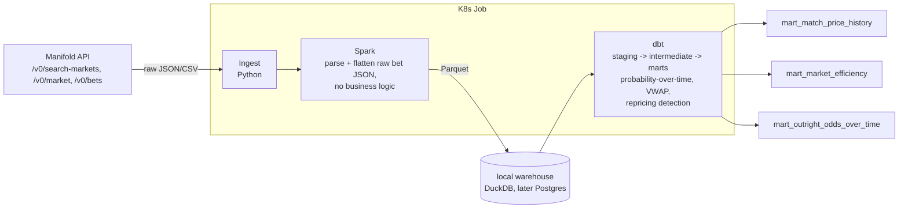

# Problem Statement & Architecture

## Problem statement

**Are prediction market prices actually well-calibrated?**

A market is "well-calibrated" if, among all the events it assigned a 70% probability to, roughly 70% of them actually happened. That's a concrete, testable claim — not just "did the favorite usually win," but "when the market said 70%, was it right about 70% of the time, and not, say, 50% or 90%?"

Applied to this dataset specifically:

1. **Match-level**: for every resolved match-outcome market, compare the market's implied probability right before kickoff (and its probability path *during* the match) against what actually happened. Bucket predictions by probability (e.g. "all the times the market said ~70%") and check the real hit rate in each bucket.
2. **Tournament-outright**: track how the "who wins the World Cup" market repriced match by match as teams were eliminated — did it correctly shed probability from teams once they were knocked out, and how fast?
3. **Repricing behavior**: within a single match's bet history, find the largest single jumps in implied probability — these should correspond to goals, red cards, and other high-information moments, even without cross-referencing an external match-events feed.

## Why this matters

Prediction markets are increasingly cited as forecasting tools for things beyond sports — elections, macro releases, geopolitical events. Whether they're actually well-calibrated, versus just popular or confident-sounding, is an empirical question, not an assumption. This project answers it for one concrete, self-contained case (World Cup 2026 markets) using the market's own data — no external results feed required, since Manifold resolutions already encode the true outcome.

It's also a real end-to-end pattern: pull raw event-level data from an external source, reconstruct a time series at scale, and validate a hypothesis with explicit data-quality guarantees. That pattern — not the World Cup specifically — is what generalizes to a job.

## Architecture

Three unfamiliar tools, so here's what each one actually *is* before getting into why it's here.

### Spark — why here, and an honest caveat

**What it is:** a distributed data-processing engine. The useful mental model isn't "makes things fast" — it's a DataFrame API designed for exactly this shape of problem: group data by key (here, by market), order it by time, and compute rolling/windowed aggregations across every group in parallel, instead of writing Python loops.

**What it does in this project:** parses and flattens raw bet-tick JSON (one row per trade, from `/v0/bets`) across hundreds of markets into clean, typed, partitioned Parquet. Deliberately bounded to extract + load only, no business logic — see [ADR-0005](decisions/0005-elt-not-etl-transformation-lives-in-dbt.md) for why: the actual probability reconstruction, VWAP, and repricing-jump detection moved to dbt, so this project earns the ELT label rather than just having a diagram shaped like one. Raw ingestion writes JSON Lines, not CSV — an earlier CSV version hit two real Spark parsing bugs that a properly-typed format doesn't have; see [ADR-0006](decisions/0006-raw-layer-jsonl-immutable.md).

**Honest caveat, worth being able to say out loud in an interview:** our actual data volume — a few hundred markets, likely tens of thousands of bets total — comfortably fits in memory and would run fine in pandas. Using Spark here is a deliberate choice to build the distributed-processing muscle (partitioning, the DataFrame API, parsing semi-structured data at scale) on a dataset small enough to debug easily, not because this specific dataset requires it. That's a legitimate reason to use it — but claiming otherwise would fall apart under a follow-up question, so the plan is to say this plainly rather than oversell it as "big data." Full decision framework — when Spark actually earns its keep vs. Polars, DuckDB, or plain pandas — in [ADR-0002](decisions/0002-spark-despite-small-data-volume.md).

### dbt — why here

**What it is:** not a processing engine — it doesn't move or compute data at scale. It's a SQL modeling layer on top of a warehouse: you write layered SQL models (staging → intermediate → marts), and dbt handles dependency ordering, testing, and documentation, all version-controlled as code.

**What it does in this project:** takes Spark's output (flattened, but not yet transformed — landed in a local warehouse, see below) and does *all* of the actual analytical work: `stg_manifold_bets` → `int_market_implied_probability` (probability-over-time reconstruction, volume-weighted average probability, and repricing-jump detection, all as SQL window functions) → the three marts (`mart_match_price_history`, `mart_market_efficiency`, `mart_outright_odds_over_time`). This is deliberate, not incidental — see [ADR-0005](decisions/0005-elt-not-etl-transformation-lives-in-dbt.md): dbt exists specifically to be the "T" in ELT, and giving it the real transformation work (rather than Spark) is what makes this pipeline genuinely ELT instead of ETL with an ELT-shaped diagram. dbt tests encode the data-quality invariants directly (probabilities bounded 0–1, no duplicate bet IDs, timestamps inside the tournament window) — this is the layer where "is this pipeline trustworthy" becomes something you can point to, not just assert.

### Kubernetes — why here

**What it is:** container orchestration — a way to declare "run these containers, in this order, with these resources" and have the cluster handle scheduling, retries, and lifecycle instead of you doing it by hand.

**What it does in this project:** packages ingest + Spark + dbt as containers and runs them as a **Job**, not a Deployment or CronJob. That distinction is deliberate and worth being able to explain: a Deployment is for long-running services that should always be up; a CronJob is for something that repeats on a schedule; a **Job** is for something that runs to completion once and stops — which is exactly this, since the tournament is over and this is a one-time backfill, not live polling. If a pod crashes mid-run, the Job controller retries it automatically up to `backoffLimit` — that's retry semantics you get from the platform instead of hand-rolling a retry loop in Python.

## Local warehouse: DuckDB first, Postgres-as-StatefulSet as phase 2

dbt needs *some* database to run against. Decided ([ADR-0004](decisions/0004-local-warehouse-duckdb-then-postgres.md)): get the pipeline working end-to-end against **DuckDB** first — an embedded, file-based SQL engine with native dbt support, no separate server/pod required — as a real working milestone. Then, as an explicit second phase for Kubernetes practice specifically (not because the pipeline needs it), swap DuckDB for **Postgres running as a StatefulSet with a PersistentVolumeClaim** — a materially different, commonly-interviewed class of Kubernetes workload than the stateless Job everything else runs as.

## Status

Ingestion, Spark, and all of dbt (staging, `int_market_implied_probability`, and `mart_market_efficiency`) are done and verified, including a real answer to the problem statement — see [docs/results.md](results.md) for the actual calibration finding and chart. A fourth real bug (search-result truncation, [ADR-0007](decisions/0007-search-limit-truncation.md)) was found and fixed along the way, recovering 232 previously-missing markets. 7 ADRs logged, several written after real mistakes rather than only the decisions that went smoothly — see [docs/decisions/](decisions/). Next, and the only core-scope piece left: Kubernetes.
