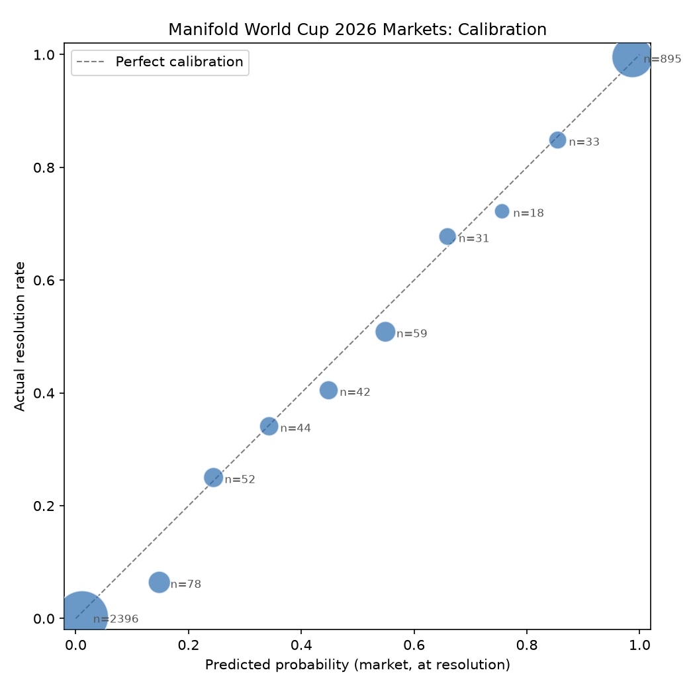

# Results: Calibration and the Favorite-Longshot Bias

This is the evidence the pipeline produces something real. It answers the two questions from the [problem statement](architecture.md#problem-statement). Generated from [`mart_market_efficiency`](../dbt/models/marts/mart_market_efficiency.sql) via [`analysis/plot_calibration.py`](../analysis/plot_calibration.py); re-running that script regenerates this chart from whatever the mart currently contains, not a one-off snapshot.



## The numbers behind the chart

| Predicted bucket | n | Avg predicted | Actual YES rate |
|---|---|---|---|
| 0.0-0.1 | 2,396 | 1.1% | 0.3% |
| 0.1-0.2 | 78 | 14.8% | 6.4% |
| 0.2-0.3 | 52 | 24.4% | 25.0% |
| 0.3-0.4 | 44 | 34.3% | 34.1% |
| 0.4-0.5 | 42 | 44.9% | 40.5% |
| 0.5-0.6 | 59 | 54.9% | 50.8% |
| 0.6-0.7 | 31 | 65.9% | 67.7% |
| 0.7-0.8 | 18 | 75.6% | 72.2% |
| 0.8-0.9 | 33 | 85.5% | 84.8% |
| 0.9-1.0 | 895 | 98.7% | 99.6% |

3,648 resolved predictions total: 209 `BINARY` markets plus every resolved `MULTIPLE_CHOICE` answer, unioned in `mart_market_efficiency`. That answer-count itself took a real fix to get right: Manifold only sets a per-answer `resolution` field for "independent" multi-choice markets, where each answer resolves on its own. For "single-select" multi-choice markets (a market resolves to one winning answer, all others lose), the winner has to be read off the *market's* `resolution` field instead, comparing it to each answer's ID. The first version of this mart missed that second shape entirely and silently dropped over a thousand real predictions platform-wide. See `lessons_learned.md`.

## Question 2: does the favorite-longshot bias show up?

**Yes, and it's the textbook shape.** At the low end (longshots, predicted probability near 0), actual outcomes happen *less* often than predicted: the 0.1-0.2 bucket predicted 14.8% on average but only 6.4% of those predictions actually resolved YES. At the high end (favorites), actual outcomes happen slightly *more* often than predicted: the 0.9-1.0 bucket, the largest and best-sampled in the dataset, predicted 98.7% and came in at 99.6%. The middle of the curve (0.2-0.4) sits close to the diagonal: near-perfect calibration. That's exactly the pattern the literature describes. The bias concentrates at the extremes and fades toward the middle, not a uniform effect across the whole probability range.

**Honest statistical caveat:** sample sizes are wildly uneven, and this matters for how much to trust each point. The two extreme buckets (2,396 and 895 predictions) are genuinely solid. The middle buckets range from 18 to 78 predictions each, thin enough that some of the wobble there (e.g., the 0.5-0.6 bucket sitting visibly below the diagonal while its neighbors don't) could easily be noise rather than signal. The part of this result I'd stand behind confidently is specifically the two extremes, which happen to be both the best-sampled *and* the most textbook-matching. That's itself a reason for confidence, not a coincidence to wave away.

### Does liquidity predict better calibration?

The problem statement's real question here: does market liquidity actually predict better calibration, or does that relationship hold up as poorly as some existing research suggests? `mart_market_efficiency` carries `liquidity_total` per prediction specifically to test this. Split into three tiers based on the actual distribution of `liquidity_total` (which clusters hard around Manifold's default market-creation subsidies, 25/100/1000, closer to a discrete creation-time tier than a smooth measure of trading depth, worth naming up front): low (≤25), default (26-100, where 1,956 of 3,648 predictions sit), and high (>100).

| Liquidity tier | n | % in extreme buckets | Brier (raw) |
|---|---|---|---|
| Low (≤25) | 907 | 96.1% | 0.0092 |
| Default (26-100) | 1,956 | 86.3% | 0.0281 |
| High (>100) | 785 | 93.1% | 0.0144 |

**At face value, low liquidity looks *better* calibrated.** The opposite of what you'd expect, a red flag rather than a finding. The same confound from Question 1 is at work: low-liquidity predictions are 96% concentrated in the two trivially-easy extreme buckets (near-certain long-shots that correctly resolved NO), so their Brier score is low because the predictions were easy, not because low-liquidity markets are genuinely better-calibrated.

**Controlling for it:** excluding the two extreme buckets, same fix as Question 1.

| Liquidity tier | n | Brier (extremes excluded) |
|---|---|---|
| Low (≤25) | 35 | 0.1784 |
| Default (26-100) | 268 | 0.1864 |
| High (>100) | 54 | 0.1539 |

**Once the confound is removed, the three tiers land in roughly the same range** (0.15-0.19): no clear, credible relationship between liquidity and calibration quality in this dataset. The high-liquidity tier does come in a bit lower, but n=54 is far too thin to call that a real effect rather than noise; two of the three tiers (low and high) have well under 60 observations once the easy predictions are excluded. **Bottom line: the liquidity-calibration relationship holds up poorly here too.** Consistent with the problem statement's framing that this relationship is often weaker than assumed. Closer to "no signal found, with limited power to find one" than a confident null result. Reproducible via [`analysis/compute_calibration_metrics.py`](../analysis/compute_calibration_metrics.py).

## Question 1: does calibration here match Manifold's platform-wide numbers?

Manifold publishes a live calibration page (`manifold.markets/calibration`) with a real, checkable number: **Brier score 0.1748**, computed hourly over a 2% sample of trades on resolved binary questions with 15+ traders (~97,000 trades). Their own stated method, quoted directly: "sample 2% of all past trades on resolved binary questions with 15 or more traders," using "the average probability between the start and end" of each trade as that trade's prediction, then bucketing trades by that probability and checking how often markets in each bucket actually resolved YES.

**First attempt, and why it was wrong.** The first version of this comparison used `mart_market_efficiency` (one row per resolved prediction, at its resolution-time probability) and got 0.0205 overall (0.1807 excluding a dominant easy bucket). That's not the same measurement Manifold publishes: it's market-grained and snapshot-in-time, not trade-grained and lifetime-weighted, and it included `MULTIPLE_CHOICE` answers that Manifold's "binary questions" population excludes. The two numbers looked comparable because they're both called "Brier score," but they weren't measuring the same thing. Worth naming plainly rather than quietly swapping in a better number.

**Matched methodology.** Built [`mart_trade_calibration`](../dbt/models/marts/mart_trade_calibration.sql): one row per real trade on a resolved `BINARY` market with 15+ distinct traders, predicted probability = `(prob_before + prob_after) / 2` (Manifold's exact "average probability between the start and end" definition), actual outcome = that market's final resolution. The one deliberate deviation: we use *every* qualifying trade rather than a 2% sample. Manifold subsamples because they're recomputing this hourly across their whole platform's trade history, a performance tradeoff that doesn't apply to a dataset this size. Using the full population is more precise, not a departure from the method's intent.

**Result: 90 qualifying `BINARY` markets, 23,805 real trades. Brier score = 0.1305**, vs. Manifold's 0.1748. Still better, but now by a believable margin, not the suspicious ~10x gap the first, mismatched comparison produced. That gap between the two comparison attempts is itself the more interesting finding: most of the earlier "our calibration is way better" result was a measurement artifact, not a real effect. Reproducible via [`analysis/compute_calibration_metrics.py`](../analysis/compute_calibration_metrics.py).

**Honest bottom line:** even the matched 0.1305 is directionally better than 0.1748, but I still wouldn't lean hard on the exact gap. Manifold's platform-wide number blends every category (politics, economics, AI, sports, crypto). This project's whole reason for existing was that no public breakdown exists for sports specifically, so the two populations aren't identical even with matched math. The favorite-longshot bias finding (Question 2, above) remains the more solid, better-supported result in this project.

## What did the market believe before kickoff, not just at resolution?

Everything above uses resolution-time probability: Manifold's own snapshot of what a market believed the moment it resolved. [ADR-0007](decisions/0007-search-limit-truncation.md) noted this wasn't the original question. The problem statement asked what the market believed right before the game started, and `sportsStartTimestamp` alone only covered about 17% of markets, not enough to build that analysis on at the time.

[ADR-0008](decisions/0008-kickoff-time-enrichment-openfootball.md) closed that gap: real kickoff times from a CC0-licensed public schedule, matched to markets/answers through three strict text patterns, validated to an exact 108-of-108 match against Manifold's own `sportsStartTimestamp` wherever both exist. That gave a genuine, validated kickoff time for 380 predictions (`mart_pre_kickoff_calibration`), a slice of the full 3,648, since only markets phrased as an actual scheduled match carry a derivable kickoff time. Prop bets, golden boot, and similar markets correctly have none.

For each of those 380 predictions, `mart_pre_kickoff_calibration` takes the market's implied probability from its last real trade strictly before kickoff, the moment the game was still genuinely undecided, and compares it to the same resolution-time probability `mart_market_efficiency` uses for the identical prediction:

| Measurement | n | Brier score |
|---|---|---|
| Pre-kickoff (last trade before the game started) | 380 | 0.1708 |
| Resolution-time (same 380 predictions) | 380 | 0.0008 |

The gap is the finding. Resolution-time probability isn't a measure of calibration for these predictions at all: by the time a Manifold market resolves, the game has been played and the outcome is known, so the "prediction" is really just recording the answer. A Brier score of 0.0008 means the market was, unsurprisingly, almost never wrong about a game that had already finished. The pre-kickoff number, 0.1708, is the one that actually reflects genuine uncertainty before the outcome existed, and it lands close to Manifold's own platform-wide binary number (0.1748, Question 1) and the middle of this project's own liquidity-tier range (0.15-0.19) above. That consistency across three independently-built numbers is a stronger signal than any one of them alone.

Reproducible via `dbt build` (rebuilds `mart_pre_kickoff_calibration`) plus the same query pattern used above; not yet wired into `analysis/compute_calibration_metrics.py`.

## Addendum: two-way real money vs. one-way spendable currency, a deliberate statistics exception

Everything above is deliberately scoped to data engineering: reconstruction, validation, honest caveats about sample size, not formal hypothesis testing. This section is a stated exception, not a quiet reversal of that scope (see [ADR-0013](decisions/0013-platform-calibration-comparison-as-a-deliberate-ds-exception.md)): asked directly whether people are more "fast and loose," worse-calibrated, on Manifold than Polymarket, and whether any difference is statistically real.

**Not simply "real money vs. fake money."** Manifold's Mana genuinely has a cash-in path (buying it directly with real dollars is one of the documented ways to get it), so calling it "play money" understates its real-world connection. Checked Manifold's actual policy rather than assumed: Mana is one-way convertible, cash buys it, but it cannot be converted back to USD, crypto, or gift cards under any circumstance (the sole exit is a fixed-rate charitable donation, Ṁ100 = $1; a prior real-cash-out program, "Sweepcash," was discontinued). The dimension that actually matters here isn't whether cash goes in, it's whether profit can come out: a Polymarket trader who's right can withdraw real gains, a Manifold trader who's right can only get more Mana. That inability to realize profit, not the absence of real money entirely, is the actual mechanism this comparison tests.

Manifold (one-way spendable currency) and Polymarket (real, two-way-convertible money) both had an outright World Cup winner market. Compared each team's last real implied probability strictly before the tournament itself started (2026-06-11 19:00 UTC, the actual first match kickoff) against the real outcome (Spain won, on both platforms):

| Platform | n | Brier score |
|---|---|---|
| Manifold (Mana, one-way convertible) | 47 | 0.0162 |
| Polymarket (real, two-way convertible) | 50 | 0.0152 |

Manifold's Brier score is nominally higher (worse), the direction the "fast and loose" hypothesis predicts. A bootstrap significance test (10,000 resamples, each platform's own sample resampled independently, see `analysis/compare_platform_calibration.py`) gives a 95% CI for the difference of **[-0.0402, 0.0422]**, comfortably including zero, and an approximate two-sided p-value of **0.83**. **No statistically significant difference.**

**The honest limitation, not glossed over:** n=47 and n=50, with exactly one true positive per platform (one team wins the whole tournament). That's a small, low-power sample by construction: resampling a set this size and this imbalanced can draw zero positives in a single bootstrap iteration, part of why the interval is this wide. A result like this is close to the most likely outcome at this sample size whether or not a real underlying difference exists, it can rule out a *large* difference between the platforms here, not a small one. This doesn't confirm real money produces better-calibrated forecasting in general; it's an honest statement that this specific, narrowly-scoped comparison couldn't detect a difference, not evidence that none exists.

Reproducible via `dbt build` (rebuilds `mart_platform_calibration_comparison`) then `python analysis/compare_platform_calibration.py`.

### How this compares to the published literature

Checked rather than assumed: two real studies have asked essentially this question before, and they don't agree with each other, which matters for how much weight to put on our own result.

**Servan-Schreiber, Wolfers, Pennock & Galebach (2004)** compared Tradesports (real money) against Newsfutures (play money) predicting NFL outcomes across the full 2003 season [1]. Quoted directly from a later paper that cites it: "a comparison of Newsfutures and Tradesports prices for securities predicting NFL victories for the 2003 season found that while the two markets often yielded different predictions, they were approximately equally well calibrated" [2]. Same direction as our result, no significant difference, but with vastly more statistical power: a full NFL season means hundreds of games with a roughly even win/loss split, not one tournament's outright winner with a single true positive.

A more recent iPredict-based study found something more nuanced: pooled across different event types, play money showed no significant excess accuracy, but **in direct comparisons of the same events across platforms**, real-money contracts predicted significantly more accurately [3]. That's methodologically the closer match to what we built here (same real-world event, both platforms, direct comparison), and it reached a significant result where ours didn't.

Our own result doesn't cleanly confirm or contradict either paper. It's consistent with the older study's direction but nowhere near its statistical power, and it directly disagrees with the newer, more methodologically similar one. Neither of those studies used a bootstrap, both appear to rely on regression-based tests with proper controls (order volume, days-to-expiry, in the iPredict case), a reasonable choice at their sample sizes that a small, single-tournament sample like ours can't really support. The honest reading: our sample can't adjudicate between the two published findings, it's underpowered relative to either.

## How much did the two platforms actually agree, not just whether the gap was significant?

A separate, purely descriptive question, deliberately without a significance test this time (see `analysis/compare_platform_predictions.py`): for the same 50 outright-winner teams, how close were Manifold's and Polymarket's pre-tournament implied probabilities to each other, team by team?

**46 of 50 teams matched across both platforms.** The 4 that didn't are a real structural difference, not a data gap: Manifold's outright market has a single "Other" catch-all answer absorbing longshots that Polymarket lists individually (Bosnia-Herzegovina, Peru, Qatar, Saudi Arabia).

**Overall agreement is close.** Mean absolute difference of 0.98 percentage points, median 0.72pp. 70% of teams were within 1pp, 91% within 2pp, and every team was within 5pp.

**Where they differed most, a real, structured pattern, not noise:** the three biggest gaps were all top favorites, and Manifold priced all three higher than Polymarket.

| Team | Manifold | Polymarket | Abs. diff |
|---|---|---|---|
| France | 21.0% | 16.1% | 4.95pp |
| Argentina | 13.0% | 8.9% | 4.15pp |
| Ecuador | 4.2% | 0.9% | 3.38pp |

Below the top few contenders, the platforms track each other almost exactly, several longshots (Czechia, Australia, Paraguay) matched within a few basis points of each other.

**Worth naming plainly:** this is the more informative result of the two comparisons in this section. The significance test above found the platforms statistically indistinguishable on aggregate calibration; this descriptive comparison shows their underlying predictions weren't identical, they diverged in a structured way concentrated specifically at the top of the market. Aggregate accuracy can look the same while the actual beliefs underneath don't, a real distinction, not a contradiction between the two results.

Reproducible via `python analysis/compare_platform_predictions.py` (after the same `dbt build` above).

## Can retrieval + a local LLM find market pairs beyond the one hand-picked above?

The comparison above covers exactly one hand-picked market pair per platform (the outright winner market). Manifold has 621 markets, Polymarket has 6,359; there are almost certainly more genuinely comparable pairs, but no way to find them at scale except manually eyeballing thousands of questions. Built a real RAG pipeline to test this: local sentence-transformer embeddings for retrieval, a local LLM (Ollama, no API key anywhere in this project) reasoning over the retrieved candidates. Full build, two real bugs found and fixed along the way, and the honest result: [ADR-0014](decisions/0014-semantic-candidate-matching-local-rag.md).

**Retrieval alone is essentially perfect on this task, evaluated against the same outright-winner group as ground truth: 48/48 (100%) hit@1** across the full 6,359-row Polymarket universe, not a narrowed subset.

**Adding an LLM reasoning step on top makes it worse, not better: only 28/48 (58%) correct.** The failure mode is concrete and checked directly, not assumed: for `"Will Norway Win The 2026 FIFA World Cup?"`, retrieval correctly ranked `"Will Norway win the 2026 FIFA World Cup? [Norway]"` at #1 (0.982 similarity), and the model's own reasoning rejected it, claiming the candidate "does not specify that it's the entire tournament", a plain misreading of text it was directly handed. Across a larger 100-pair sample, every rejected pair had a retrieval score in the 0.90-0.95 band; everything the model confirmed was essentially an exact wording match (>0.95). The model appears to require near-literal text agreement to confirm a match, and rejects genuine paraphrases a human would recognize immediately as the same event.

On the 12 known-negative teams (no correct Manifold match exists, including 8 genuine Polymarket placeholder markets for unassigned qualification slots), generation produced only 1 false positive, so it isn't *reckless*, it's specifically over-conservative on true positives.

**Bottom line: retrieval is the trustworthy, usable half of this feature today; generation isn't, and neither is wired into any mart.** Reproducible via `python analysis/find_candidate_market_matches.py`, `analysis/explain_top_candidate_matches.py`, and `analysis/evaluate_candidate_matches.py` (needs the separate `venv-semantic-matching/` and Ollama, see `requirements.md`).

## What would strengthen this

Not done here, and worth being explicit about rather than implying this is the final word:

- **The middle-bucket sample sizes are the real limitation.** More data (a longer time window, additional tournaments) would matter more than any modeling change. Same limitation shows up sharper in the liquidity breakdown above, two of three tiers drop to n=54ish once the easy predictions are excluded.
- **The pre-kickoff comparison covers 380 of 3,648 predictions (about 10%).** Widening it further would mean either loosening the strict match patterns in `int_market_kickoff_times.sql` (rejected in ADR-0008, the false-positive risk outweighs the coverage gain) or finding a second schedule source for the market types that don't fit the three current patterns.

## Reproduce it

```bash
cd dbt && dbt deps && dbt build --profiles-dir .
cd .. && python analysis/plot_calibration.py
python analysis/compute_calibration_metrics.py
python analysis/compare_platform_calibration.py
python analysis/compare_platform_predictions.py
```

## References

1. Servan-Schreiber, E., Wolfers, J., Pennock, D.M., Galebach, B. (2004). *Prediction Markets: Does Money Matter?* Electronic Markets, 14(3).
2. Wolfers, J., Zitzewitz, E. (2006). *Five Open Questions about Prediction Markets.* Federal Reserve Bank of San Francisco Working Paper 2006-06. (Quotes and cites [1]'s NFL comparison directly.)
3. iPredict-based study on real-money vs. play-money forecasting accuracy, direct same-event comparison. *Real-Money Vs. Play-Money Forecasting Accuracy in Online Prediction Markets: Empirical Insights from iPredict.* Journal of Prediction Markets. (Findings accessed via publisher abstract/summary, not the full paper; cited here for its stated result, not verified line-by-line the way [1] and [2] were.)
